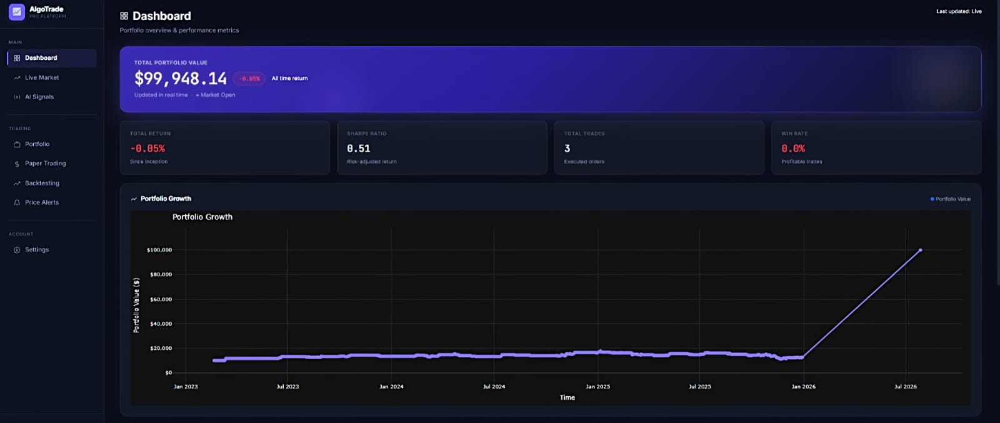
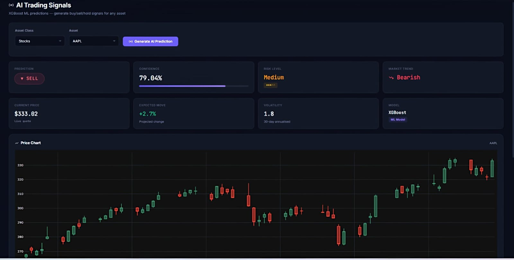
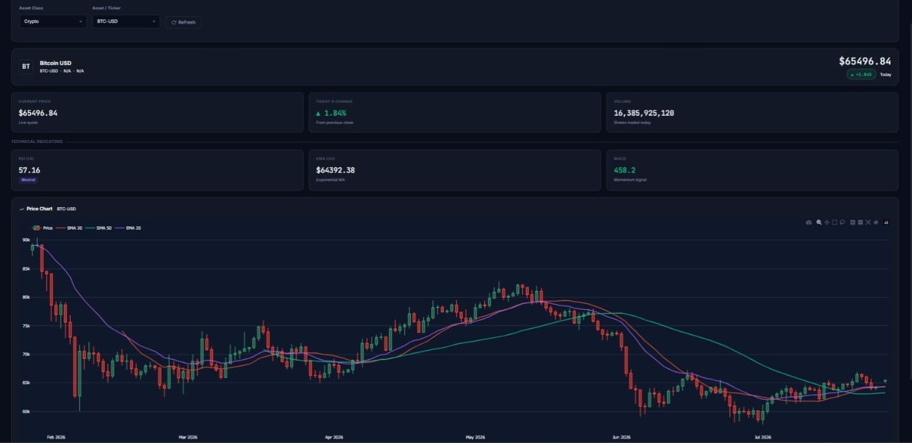
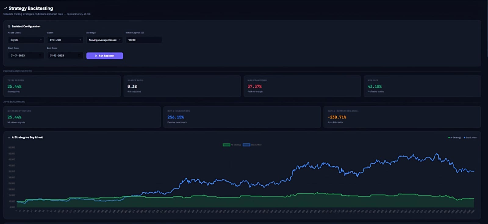
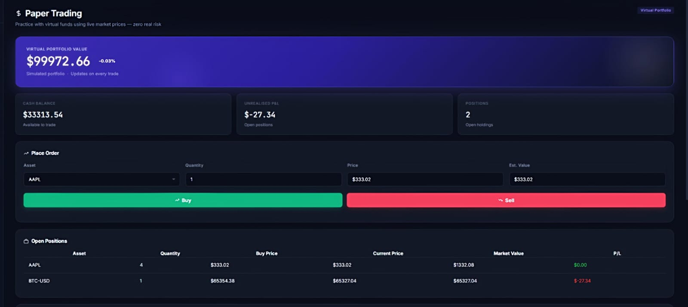

# 📈 AlgoTrade Pro – AI Powered Algorithmic Trading Platform

An end-to-end AI-powered algorithmic trading platform built using **Python, Flask, XGBoost, JavaScript, HTML/CSS, SQLite, and Plotly**.

The platform enables users to analyze markets, generate AI trading signals, backtest strategies, manage portfolios, paper trade, and monitor live financial markets—all through a modern web interface.

---

## 🚀 Features

### 🤖 AI Trading Signals
- XGBoost-powered BUY / SELL predictions
- Confidence score for every prediction
- Risk assessment
- Trend analysis
- Technical indicator based reasoning
- Supports multiple asset classes

### 📊 Strategy Backtesting
- Compare AI Strategy vs Buy & Hold
- Total Return
- Sharpe Ratio
- Maximum Drawdown
- Win Rate
- Trade History
- Interactive Equity Curve

### 💼 Portfolio Management
- Track investments
- Portfolio allocation
- Profit & Loss analysis
- Holdings management

### 📄 Paper Trading
- Simulate trading without risking real money
- Virtual portfolio
- Performance tracking

### 📈 Live Market Dashboard
- Live market prices
- Candlestick charts
- Volatility analysis
- Expected price movement

### 🌍 Multi Asset Support

- 🇺🇸 US Stocks
- 🇮🇳 Indian Stocks
- ₿ Cryptocurrencies
- 💱 Forex
- 📊 Global Indices
- 🛢 Commodities

---

# 🛠 Tech Stack

### Backend
- Python
- Flask

### Machine Learning
- XGBoost
- Scikit-learn
- Joblib

### Data Analysis
- Pandas
- NumPy
- TA (Technical Analysis Library)

### Market Data
- Yahoo Finance API (yfinance)

### Database
- SQLite

### Frontend
- HTML5
- CSS3
- JavaScript

### Visualization
- Plotly
- Chart.js

---

# 📂 Project Structure

```
Algorithmic-Trading-Platform/
│
├── app/
├── config/
├── data/
├── database/
├── models/
├── screenshots/
├── tests/
├── requirements.txt
├── server.py
└── README.md
```

---

# 📸 Screenshots

## Dashboard



---

## AI Signals



---

## Live Market



---

## Strategy Backtesting



---

## Paper Trading



---

# ⚙ Installation

Clone the repository

```bash
git clone https://github.com/iirfanshk/Algorithmic-Trading-Platform.git
```

Move into the project

```bash
cd Algorithmic-Trading-Platform
```

Create a virtual environment

```bash
python -m venv .venv
```

Activate it

Windows

```bash
.venv\Scripts\activate
```

Install dependencies

```bash
pip install -r requirements.txt
```

Run the application

```bash
python server.py
```

Open

```
http://127.0.0.1:5000
```

---

# 📌 Future Improvements

- Live brokerage integration
- Reinforcement Learning strategies
- Portfolio optimization
- News sentiment analysis
- Options trading support
- Multi-user cloud deployment
- Docker deployment
- CI/CD pipeline

---

# 👨‍💻 Author

**Shaik Irfan**

GitHub:
https://github.com/iirfanshk

LinkedIn:
linkedin.com/in/shaik-irfan-79b0ba317

---

## ⭐ If you like this project, don't forget to star the repository!
